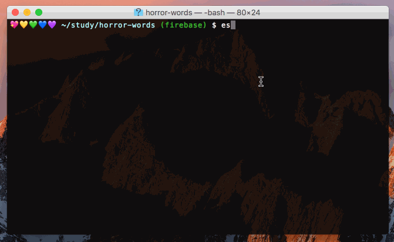

# Let's get linting!

## Intro
Linters are really useful as they detect and flag errors in your code. This readme is going to walk through how to set up `eslint` on your projects. This is useful because it:
- it checks your syntax before code is run to catch errors
- gives fixed formatting rules for your code eg indentation, spacing ect
- allows you to share a config file between your team to avoid merge conflicts

It does this by highlight errors with a :red_circle: and telling you what's wrong so you can fix it. Whilst learning it is recommended that you do this manually so you can embed good coding practises. 
## Let's do the thing

### Setup eslint config
`npm i -g eslint` - globally installs eslint _(only needs to be done once)_

The following instructions need to be followed by **one person on your team**  
`cd [project-name]` - cd into your project

`eslint --init` - initialises eslint on your project
After this pick the following inputs:
- [How would you like to configure ESLint?] `Use a popular style guide`
- [Which style guide do you want to follow?] `Airbnb`
- [Do you use React?] `No`
- [What format do you want your config file to be in?] `JSON`

Note - only one person needs to set eslint up for each project. Everyone else can get the packages by running `npm i`

:boom: BOOM :boom: and now for...
### Setup your editor
To get your linter configuration working with your editor you need to install the following packages:

**Atom** - `linter`, `linter-eslint`, `linter-ui-default`  
**VS Code** - `eslint`  
**VIM** - `¯\_(ツ)_/¯`

Restart your editor and linting will be enabled :heart: