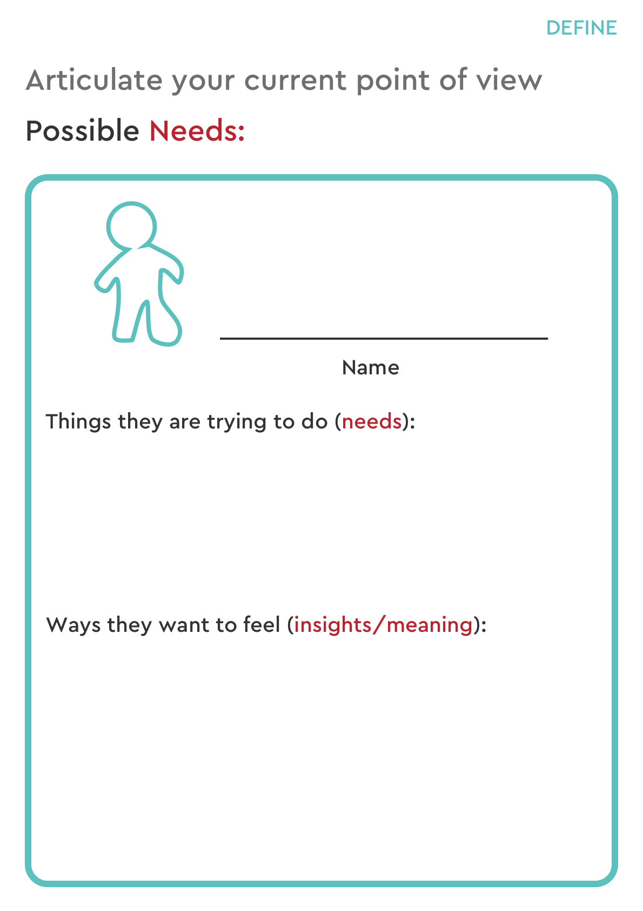
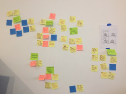

## Define

### Point of View
The purpose of this activity is to help you synthesise information to develop point of view statements and to generate potential ideas.

**Materials:** Pen, Paper, notes from empathy, worksheets

1. Using what you discovered in the Empathise stage, record the needs and insights of your group's user persona on worksheet 1:

2. Generate Point of View problem statements in the following format

_______ needs a way to __________ so she/he can __________________

Remember: ‘needs’ should be verbs.

### How Might We exercise
This exercise is about turning problems into opportunities

Each member of the team needs to follow the steps below individually (without discussing):
1. Convert the problem statements into questions that finish the sentence "How might we..."
1. Write each question on a sticky note, with the letters “HMW” in the top left corner
1. Peel off the note and stick to the wall

Once all of your team members have their questions on the wall, read through what you have each created and...
1. Identify themes and common patterns among the ideas
1. Move the post its to group the post its with similar themes
1. Make a record of themes you need to address

