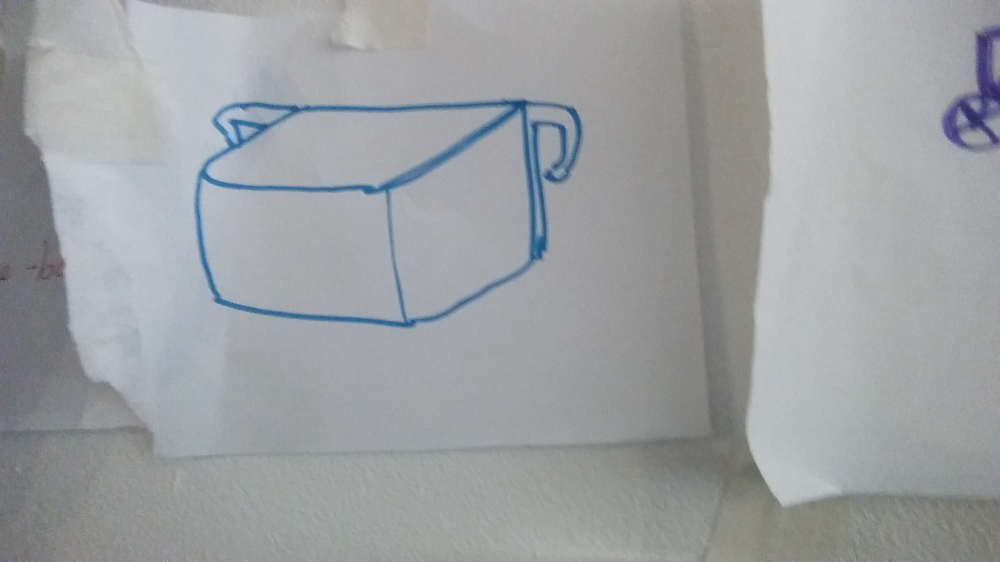
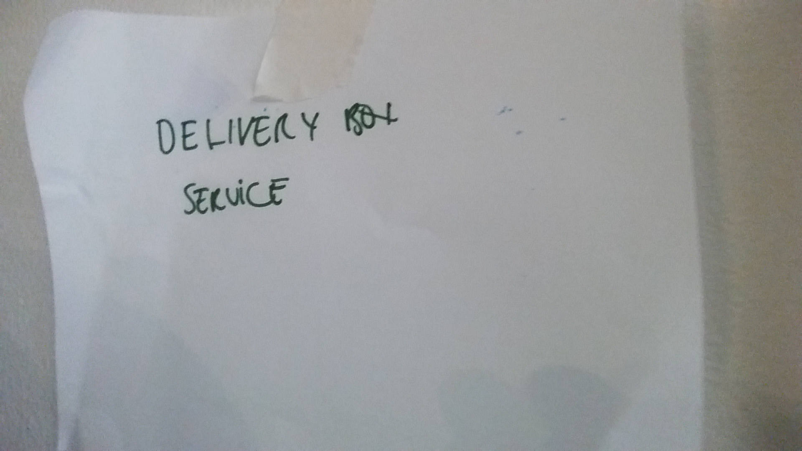
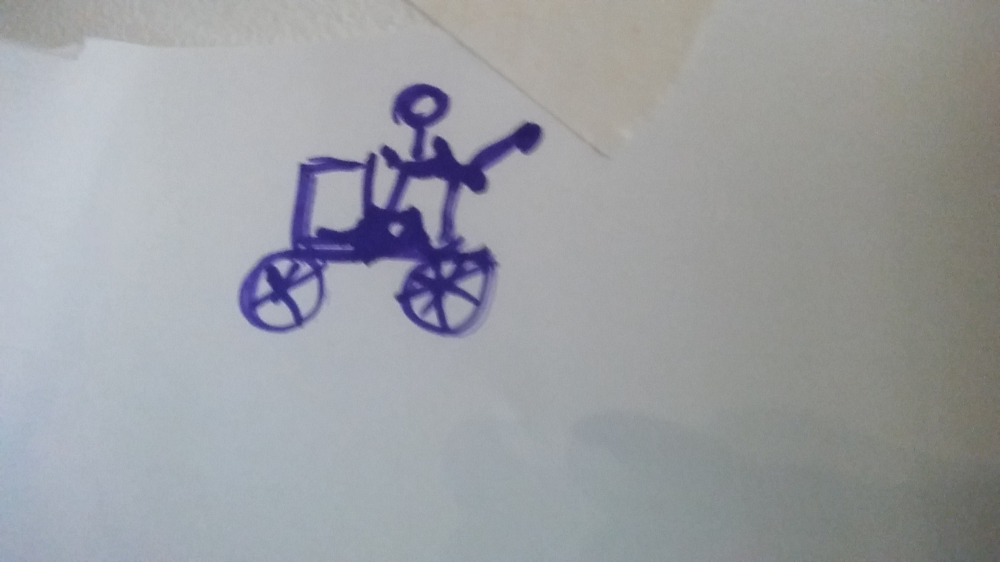
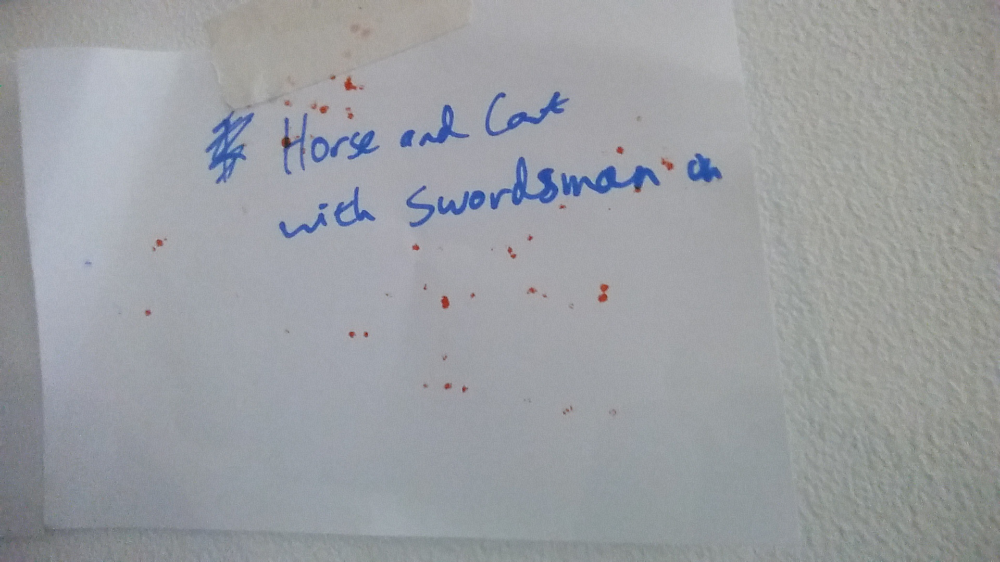
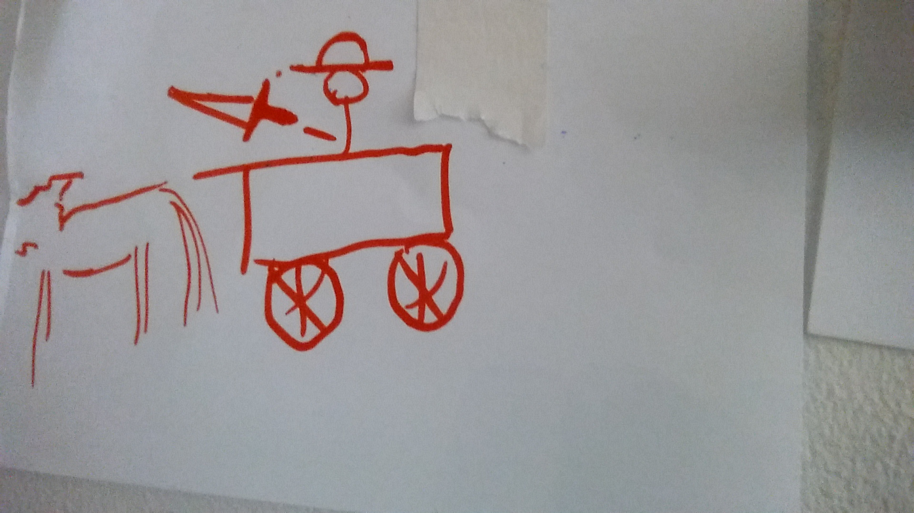

## Design Thinking Talk

[Youtube video](https://www.youtube.com/watch?time_continue=10&v=caYIXjB0EWA) of talk as delivered to FAC10.

### Game
+ Write 4 "client instructions" on separate sheets of paper
  + A Sack Race
  + A Doggy Bike Basket
  + A Daredevil Jump
  + A Baby Shower
+ Put each one face-down with a different group of students
+ First student draws a picture based on the description. Next student writes description based on picture. Cycle continues through 7/8 iterations.

#### Example: a doggy bike basket

### Showcase
+ Students stick pictures & description on the wall with masking tape
+ Go through each group's papers

Lesson: without a proper line of communication, things get misinterpreted and assumptions get made
