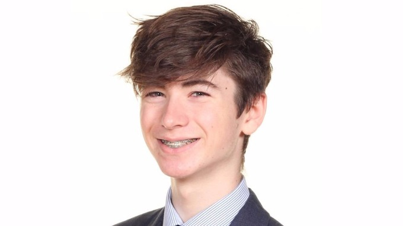

### Project: Literature Study Tool

**Quotes:**  
I want to pass my exams but don’t know where to start.  
We’ve just seen a past paper and there’s no way I’ll be able to do it!  
I’m just no good at English.  

**Key Facts:**  
Name: Owen  
Age: 15  
Year: 11  
From: London  
School: mixed-ability  
Family: oldest of 3  
Parents: want him to do better than they did, but don’t know how to help  
Hobbies: Gaming and Football

**Owen feels:**  
+ Overwhelmed!  
+ Anxious at a low level  
+ Feels the need for encouragement and praise  
+ Shy with strangers  

**Motivations:**  
+ not feeling stupid
+ feeling of improvement
+ stay at same 6th form as mates

**Goals:**
+ pass exams
+ keep parents happy
+ not spend all time studying
+ spending time with friends

**Frustrations:**  
+ Feeling stuipd
+ ‘what’s the point?’
+ parental expectations
+ no time for fun
+ things moving too fast (especially in school)
+ stupid old words
+ long boring texts

**Behaviours:**
+ Makes decisions slowly - doesn’t want to get it wrong and look stupid…
+ Decisions are based on facts (except in social situations!)
+ Trustworthy and reliable
+ Sees the best in people, very trusting in others, somethimes too trusting of authoritative voice
+ Likes functional benefits

**Likes:**
+ Football
+ Gaming
+ His friends

**Dislikes:**
+ Reading long things
+ Feeling confused
+ Feeling left out
+ Looking different
+ Sister’s music choices

**Aspirations:**
+ make Mum and Dad proud
+ wants a nice life
+ wants people around him to be happy

**Tech:**
+ Xbox important! (FIFA)
+ Mobile - android
+ shares basic laptop with parents
+ shared family tablet
+ uses Snapchat and WhatsApp
+ texts lots
+ also likes funny videos
